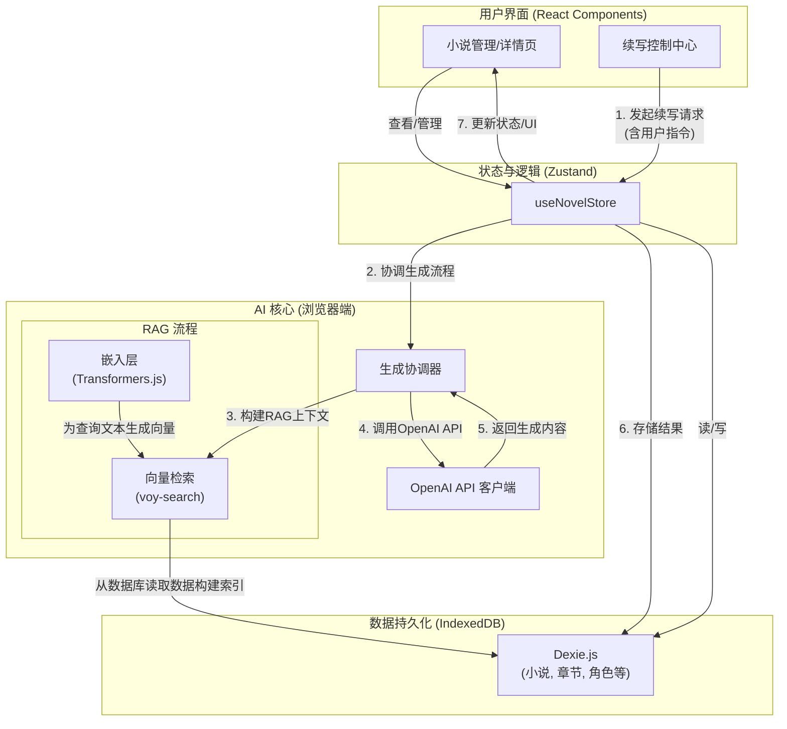

# ∞ Infinite Novel

### "让您的小说，永远有下一章。"

[](https://nextjs.org/)
[](https://www.typescriptlang.org/)
[](https://tailwindcss.com/)
[](https://ui.shadcn.com/)
[](https://github.com/pmndrs/zustand)
[](https://dexie.org/)
[](https://opensource.org/licenses/MIT)

**Infinite Novel** 是一个基于多 Agent 协作的无限扩展 AI 创作平台。它致力于解决长篇小说创作中的连贯性、创新性和可持续性问题，为作者提供一个永不枯竭的灵感源泉和创作伙伴。

## 📝 项目状态 (Project Status)

**当前阶段: 核心功能开发中 (Core Functionality in Development)**

项目目前处于早期开发阶段，已完成基础架构搭建和核心小说管理界面的开发。我们正在积极推进小说内容生成与展示等高级功能的实现。

## 🏗️ 项目架构 (Project Architecture)



## ✨ 已实现功能 (Implemented Features)

-   **🖋️ 创建小说**:
    -   支持自定义小说名称、题材、创作风格。
    -   可设定**目标总章节数**，为后续内容生成提供规划基础。
    -   提供"特殊要求"输入框，允许用户为 AI 设定更精细的创作指令。
-   **📚 小说管理**:
    -   采用现代化的**卡片式布局**展示小说列表。
    -   每张卡片清晰展示小说封面、名称、题材和**章节进度条**。
    -   提供快速访问**查看详情**和**删除小说**的操作。
-   **⚡️ 现代化技术栈**:
    -   使用 **Next.js App Router** 构建，性能卓越，体验流畅。
    -   通过 **Dexie.js** 将所有小说数据持久化存储在客户端 (IndexedDB)，无需后端服务，保障数据私密性。
    -   利用 **Zustand** 进行轻量、高效的全局状态管理。
    -   表单采用 **React Hook Form** 和 **Zod** 进行构建和验证，确保数据输入的准确性。
    -   通过 **Sonner** 提供简洁、美观的即时操作反馈通知。
-   **🎨 高度可定制的 UI**:
    -   基于 **Tailwind CSS** 和 **shadcn/ui** 构建，美观、一致且易于扩展。
    -   全局使用自定义字体，并配有 **Lucide React** 图标库，提升视觉体验。
-   **🧠 智能上下文生成 (RAG)**:
    -   内置 **HuggingFace Transformers.js** 本地嵌入模型与 **voy-search** 向量检索引擎。
    -   在生成新章节前，自动为小说所有章节、角色、线索建立语义索引。
    -   通过 **检索增强生成 (RAG)** 技术，为 AI 提供最相关的故事上下文，极大提升长篇小说创作的连贯性。
-   **🎭 沉浸式叙事元素生成与管理**:
    -   **AI 自动分析**: 新章节生成后，AI 会自动分析内容，**提取新登场的人物和浮现的新情节线索**，并自动将其存入数据库。
    -   **完整的详情页面**: 提供集成的视图来管理和浏览所有章节、角色和情节线索。
    -   **章节阅读器**: 提供一个弹出的、沉浸式的组件 (`ChapterViewer`) 用于阅读单个章节的完整内容。
-   **✍️ 高级续写控制 (Advanced Continuation Control)**:
    -   提供一个**续写控制中心** (`ExpansionControlCenter`)。
    -   允许用户在 AI 生成下一步内容前，通过更精细的指令（如"本章需要体现主角的犹豫"、"让配角A出场推动剧情"）进行微调和指导。
    -   支持无指令情况下，让 AI 根据大纲和上下文自动续写。


## 🛠️ 技术栈 (Tech Stack)

-   **框架 (Framework)**: [Next.js](https://nextjs.org/) 14 (App Router)
-   **语言 (Language)**: [TypeScript](https://www.typescriptlang.org/)
-   **样式 (Styling)**: [Tailwind CSS](https://tailwindcss.com/)
-   **UI 组件库 (UI Components)**: [shadcn/ui](https://ui.shadcn.com/), [Lucide React](https://lucide.dev/)
-   **客户端状态管理 (State Management)**: [Zustand](https://github.com/pmndrs/zustand)
-   **客户端数据库 (Client-side DB)**: [Dexie.js](https://dexie.org/) (IndexedDB Wrapper)
-   **表单处理 (Forms)**: [React Hook Form](https://react-hook-form.com/) & [Zod](https://zod.dev/)
-   **通知 (Notifications)**: [Sonner](https://sonner.emilkowal.ski/)
-   **AI (已实现/Implemented)**: [@huggingface/transformers](https://huggingface.co/docs/transformers.js/index), [voy-search](https://github.com/voy-search/voy)

## ⚡ 本地运行 (Getting Started)

1.  **克隆仓库**
    ```bash
    git clone https://github.com/SliverKeigo/infinitenovel.git
    cd infinitenovel
    ```

2.  **安装依赖**
    ```bash
    npm install
    ```

3.  **启动开发服务器**
```bash
npm run dev
    ```

4.  **打开浏览器**
    访问 [http://localhost:3000](http://localhost:3000) 查看项目。
