# ∞ Infinite Novel

[](https://nextjs.org/)
[](https://www.typescriptlang.org/)
[](https://tailwindcss.com/)
[](https://ui.shadcn.com/)
[](https://github.com/pmndrs/zustand)
[](https://dexie.org/)
[](https://opensource.org/licenses/MIT)

> **"让您的小说，永远有下一章。"**

**Infinite Novel** 是一个实验性的、基于多 Agent 协作的 AI 小说创作平台。它旨在探索解决长篇小说创作中上下文连贯性、角色一致性和情节可持续性的挑战，为创作者提供一个永不枯竭的灵感源泉和写作伙伴。本项目所有数据均存储于用户本地浏览器，确保隐私安全。

## 核心功能

-   **✍️ AI 驱动的创作流程**:
    -   **创建与设定**: 支持自定义小说名称、题材、风格，并提供"特殊要求"输入框以微调 AI 创作方向。
    -   **智能生成**: AI 根据初始设定，自动生成故事大纲、角色设定，并创作后续章节。
    -   **小说概要**: 在生成大纲后，AI 会自动提炼和生成整部小说的概要。

-   **🧠 上下文感知的续写 (RAG)**:
    -   **本地向量化**: 使用 `Transformers.js` 在浏览器端直接运行嵌入模型，对小说章节、角色、线索进行向量化。
    -   **精准检索**: 集成 `voy-search` 引擎，在生成新内容前，通过向量检索最相关的上下文。
    -   **保持连贯**: 通过检索增强生成 (RAG) 技术，确保角色行为、情节发展的高度连贯性。

-   **🎭 动态的世界构建**:
    -   **自动元素提取**: AI 在生成新章节后，能自动识别并提取新登场的角色和关键情节线索。
    -   **集成式管理**: 在统一的详情页中，集中管理和浏览所有章节、角色、线索和数据。
    -   **沉浸式阅读**: 提供简洁的章节阅读器，优化阅读体验。

-   **🔐 纯客户端，保障隐私**:
    -   **本地存储**: 所有数据（小说、章节、角色等）通过 `Dexie.js` (IndexedDB) 存储在用户本地浏览器中。
    -   **无需后端**: 无需注册或依赖服务器，打开网页即可使用，保障数据私密性。

-   **🎨 现代化的技术与设计**:
    -   **技术栈**: 基于 Next.js 14 (App Router), React, TypeScript 构建。
    -   **UI/UX**: 使用 Tailwind CSS 和 `shadcn/ui` 构建美观、响应式的用户界面，并通过 `Framer Motion` 增强交互动画。
    -   **状态管理**: 使用 `Zustand` 进行轻量、高效的全局状态管理。

## 项目架构

```mermaid
graph TD
    subgraph "用户界面 (React Components)"
        direction LR
        A1["小说管理/详情页"]
        A2["续写控制中心"]
    end

    subgraph "状态与逻辑 (Zustand)"
        B["useNovelStore"]
    end

    subgraph "AI 核心 (浏览器端)"
        C["生成协调器 (Generation Coordinator)"]
        subgraph "RAG 流程"
            D["嵌入层<br/>(Transformers.js)"]
            E["向量检索<br/>(voy-search)"]
        end
        F["OpenAI API 客户端"]
    end
    
    subgraph "数据持久化 (IndexedDB)"
        G["Dexie.js<br/>(小说, 章节, 角色等)"]
    end

    %% 用户操作
    A1 -- "查看/管理" --> B
    A2 -- "1. 发起续写请求<br/>(含用户指令)" --> B

    %% 状态逻辑
    B -- "2. 协调生成流程" --> C
    B -- "7. 更新状态/UI" --> A1
    B -- "6. 存储结果" --> G

    %% AI 核心逻辑
    C -- "3. 构建RAG上下文" --> E
    E -- "从数据库读取数据构建索引" --> G
    D -- "为查询文本生成向量" --> E
    C -- "4. 调用OpenAI API" --> F
    F -- "5. 返回生成内容" --> C

    %% 数据流动
    B -- "读/写" --> G
```



## 技术栈

-   **框架**: [Next.js](https://nextjs.org/) 14 (App Router)
-   **语言**: [TypeScript](https://www.typescriptlang.org/)
-   **UI**: [React](https://reactjs.org/), [Tailwind CSS](https://tailwindcss.com/), [shadcn/ui](https://ui.shadcn.com/), [Framer Motion](https://www.framer.com/motion/)
-   **状态管理**: [Zustand](https://github.com/pmndrs/zustand)
-   **客户端数据库**: [Dexie.js](https://dexie.org/) (IndexedDB Wrapper)
-   **表单**: [React Hook Form](https://react-hook-form.com/) & [Zod](https://zod.dev/)
-   **AI & 向量检索**: [@huggingface/transformers](https://huggingface.co/docs/transformers.js/index), [voy-search](https://github.com/voy-search/voy)
-   **图标 & 通知**: [Lucide React](https://lucide.dev/), [Sonner](https://sonner.emilkowal.ski/)

## 本地运行

1.  **克隆仓库**
    ```bash
    git clone https://github.com/SliverKeigo/infinitenovel.git
    cd infinitenovel
    ```

2.  **安装依赖**
    ```bash
    npm install
    ```

3.  **启动开发服务器**
    ```bash
    npm run dev
    ```

4.  **打开浏览器**
    访问 [http://localhost:3000](http://localhost:3000) 开始使用。


## 许可证

本项目基于 [MIT License](https://opensource.org/licenses/MIT) 开源。
